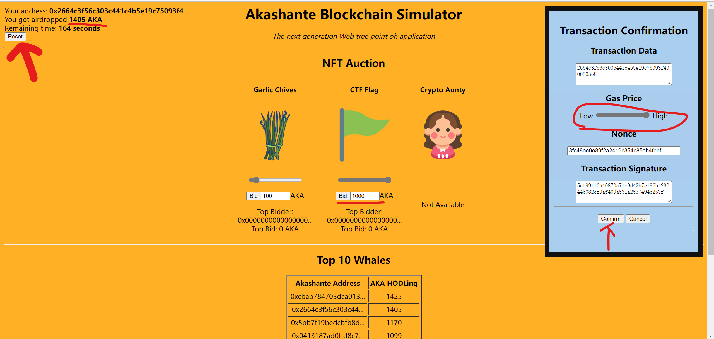
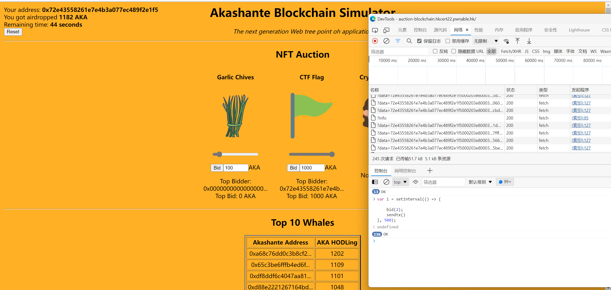
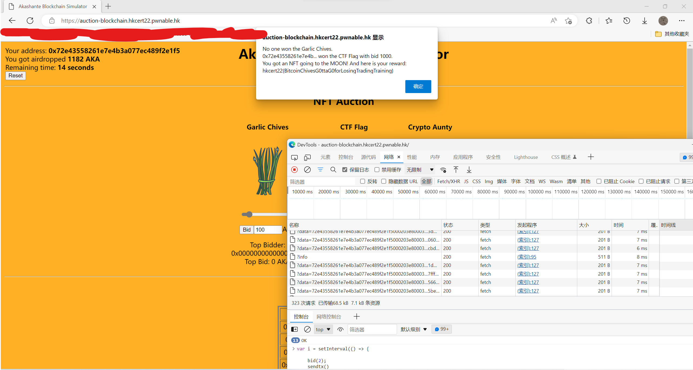

# Auction with Blockchain

詳細視頻解釋： https://youtu.be/gudc2FbEtZU

## 1.
`Reset` 多次，以獲得足夠的貨幣<br>
然後將價格設置爲 `1000` ，將 `Gas Price` 設置爲最高<br>
並確認交易



## 2.
打開 `瀏覽器開發者工具` ，切換到 `控制台`<br>
粘貼以下代碼

```javascript
var i = setInterval(() => {
    bid(2);
    sendtx()
}, 500);
```

（可能彈 error ，關閉即可）



## 3.
等待結束 :)



hkcert22{BitcoinChivesG0ttaG0forLosingTradingTraining}
