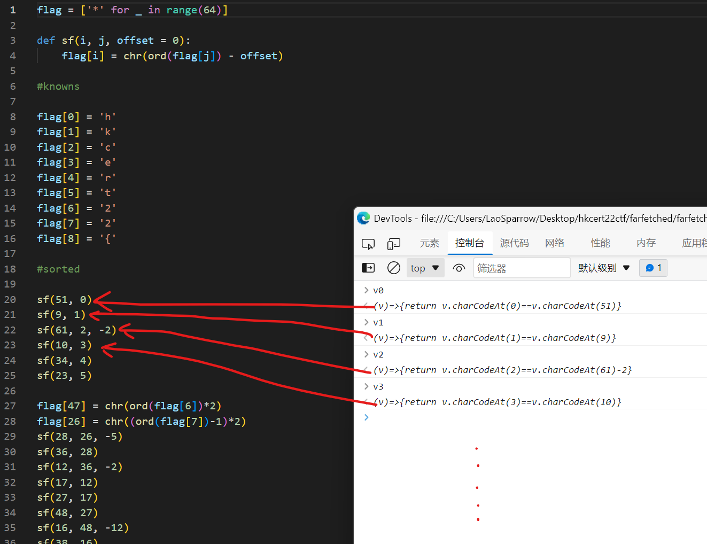
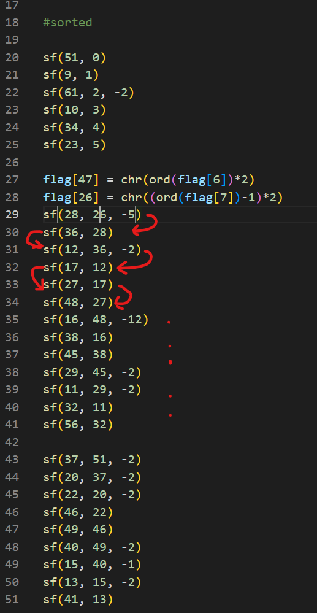
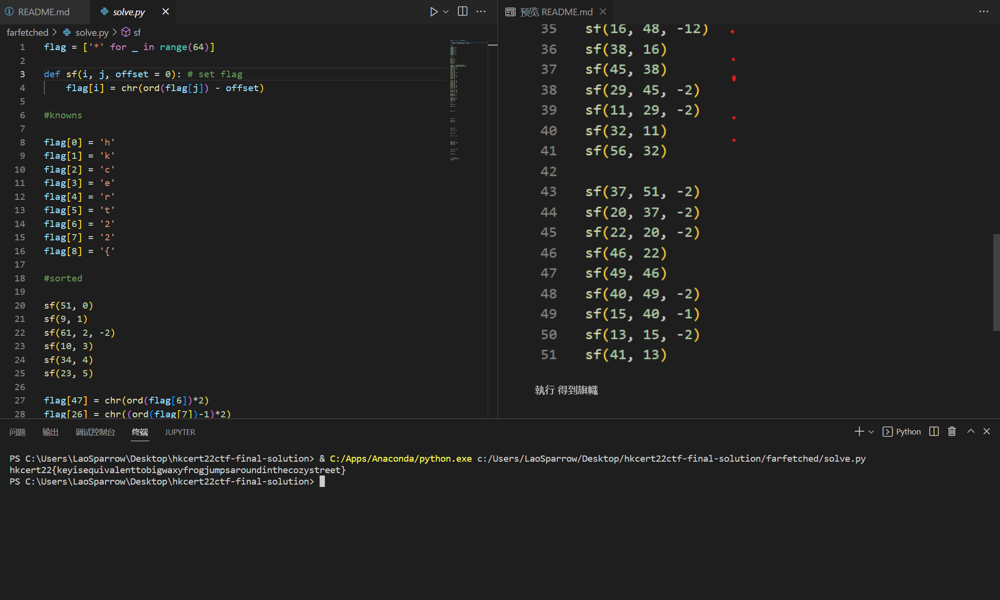

# Farfetched

根據 <a href="https://hackmd.io/@blackb6a/hkcert-ctf-2022-ii-en-6a196795#%E6%B8%A3%E8%8F%AF%E9%81%93%E8%A1%97%E5%B8%82%E5%8F%8A%E7%86%9F%E9%A3%9F%E4%B8%AD%E5%BF%83--Farfetched-Reverse">https://hackmd.io/@blackb6a/hkcert-ctf-2022-ii-en-6a196795#%E6%B8%A3%E8%8F%AF%E9%81%93%E8%A1%97%E5%B8%82%E5%8F%8A%E7%86%9F%E9%A3%9F%E4%B8%AD%E5%BF%83--Farfetched-Reverse</a>

將所有 `v**` 内的邏輯用 python 重新寫一遍

根據依賴先後排序

執行 得到旗幟

