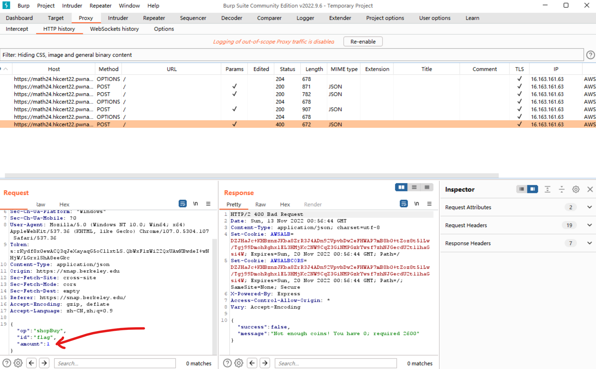
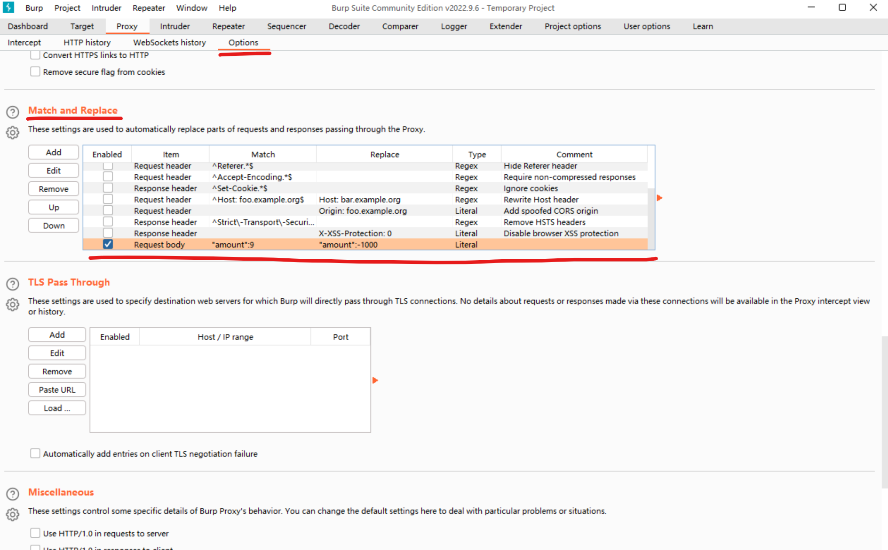
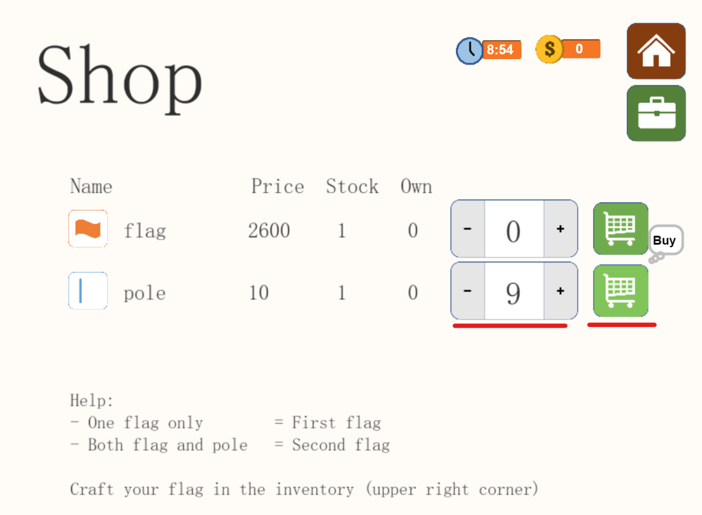
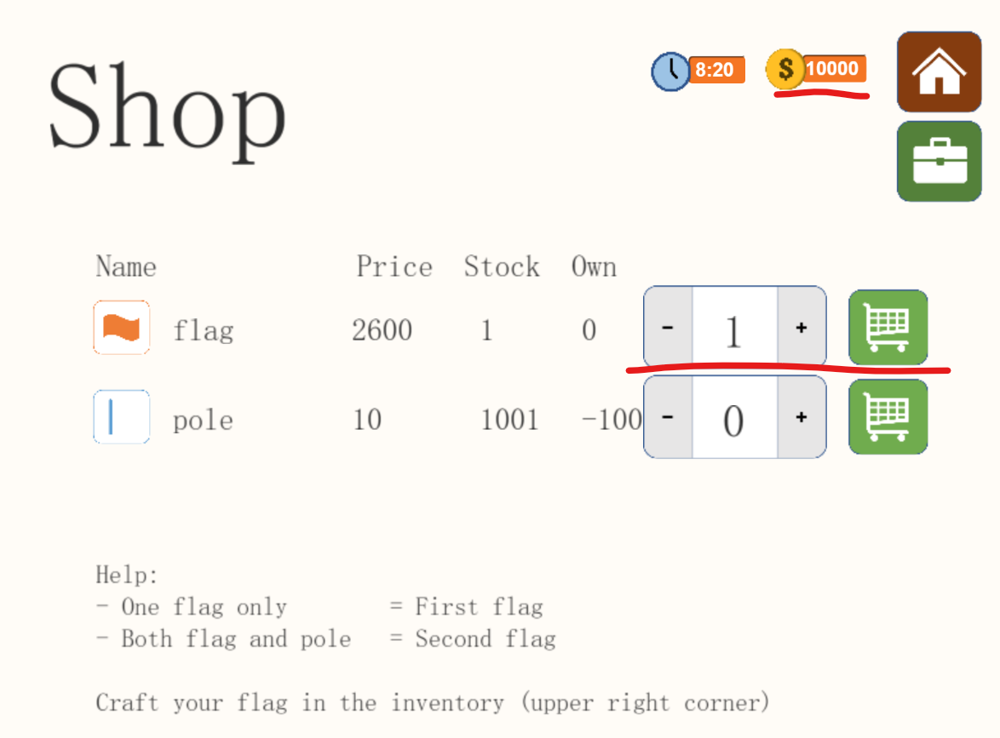
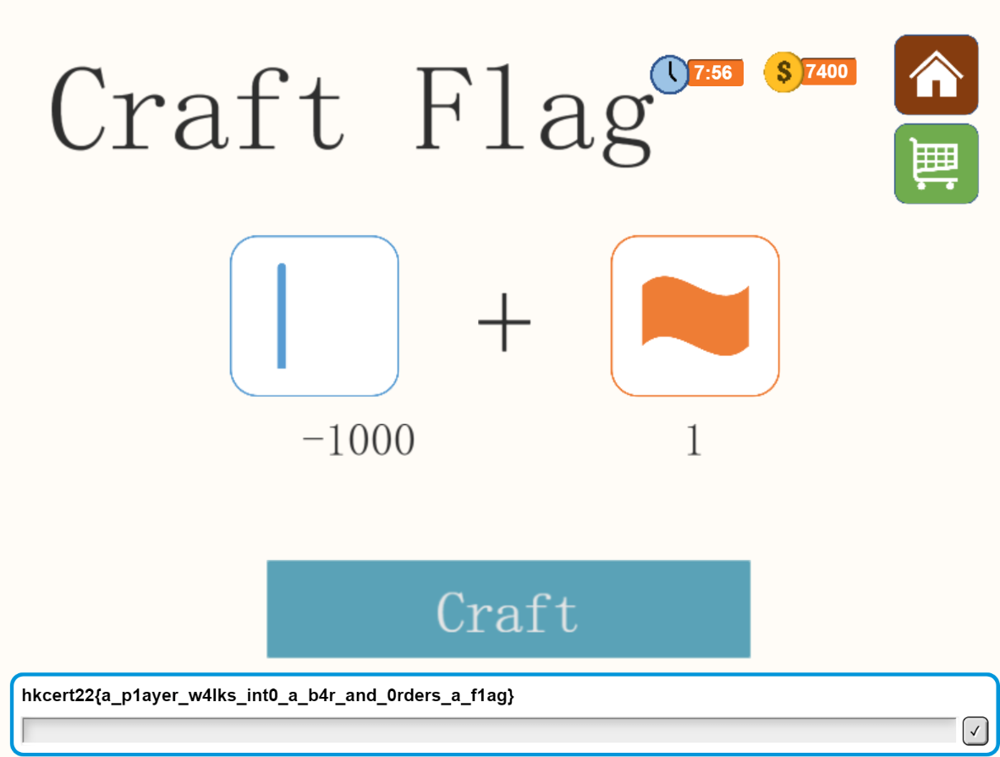

# The Math24 Game 1

使用 `Burp Suite` 抓包 <br>
得知購買物品時會發出如下請求



如果我們 ***賣*** 點東西給服務器會發生什麽呢？

在 Burp Suite 的 `Options` 下的 `Match and Replace` 下 <br>
添加一行修改



```
Item:       Request Body
Match:      "amount":9
Replace:    "amount":-1000
```

***賣*** Poles



好，現在跟服務器借了點錢

買 Flag



Craft 一下，旗幟顯現

