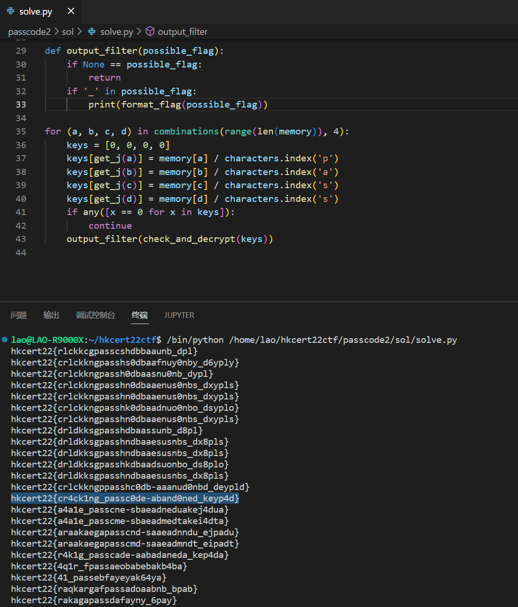

# Scratch Passcode 2

將 scratch 内的產生密碼的邏輯搬到 python <br>
編寫邏輯 測試所有可能性

```python
for (a, b, c, d) in combinations(range(len(memory)), 4):
    keys = [0, 0, 0, 0]
    keys[get_j(a)] = memory[a] / characters.index('p')
    keys[get_j(b)] = memory[b] / characters.index('a')
    keys[get_j(c)] = memory[c] / characters.index('s')
    keys[get_j(d)] = memory[d] / characters.index('s')
    if any([x == 0 for x in keys]):
        continue
    output_filter(check_and_decrypt(keys))
```

關於爲什麽要使用 `combinations()`：<br>
因爲 'pass' 這個字符串不一定是連續的 <br>
有可能是 `pa**ss` 又或是 `p*as*s` <br>
(`*`代表被丟棄的字符)

而根據大部分旗幟的共性：都包含 `_` 這一字符 <br>
我們可以篩除大部假旗幟

在脚本輸出中找出最有可能的旗幟

