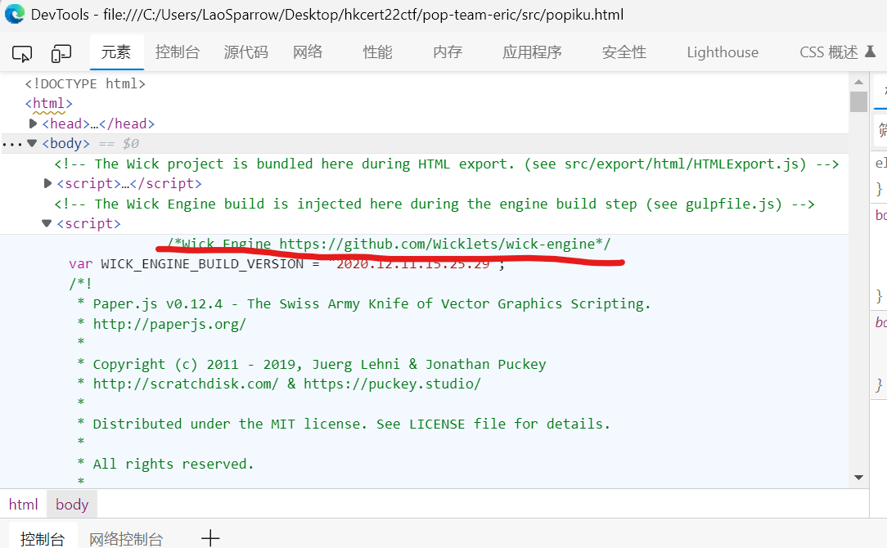
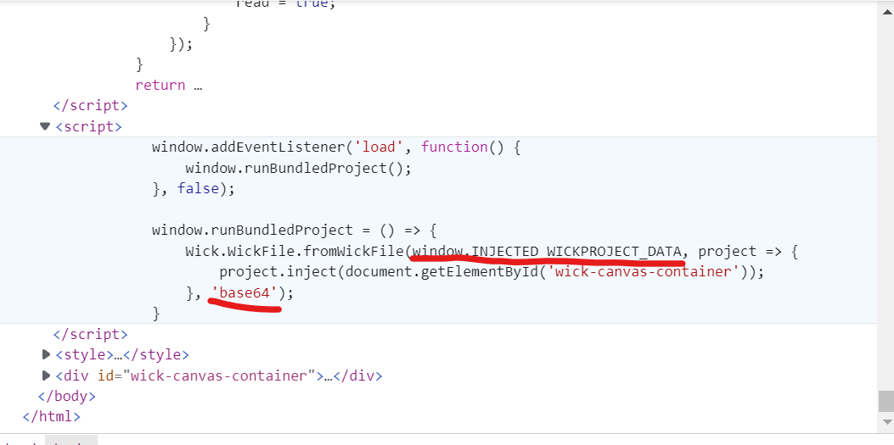
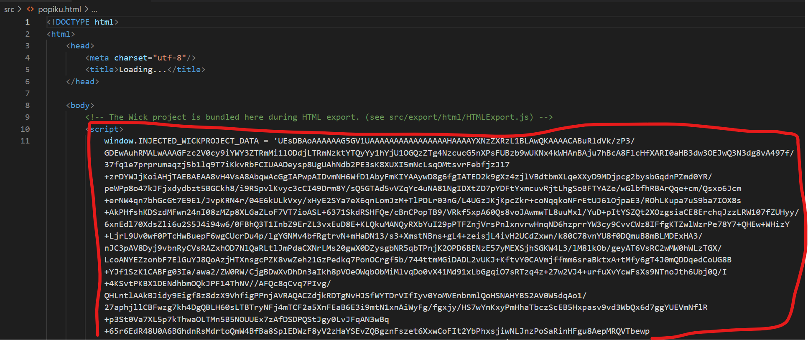
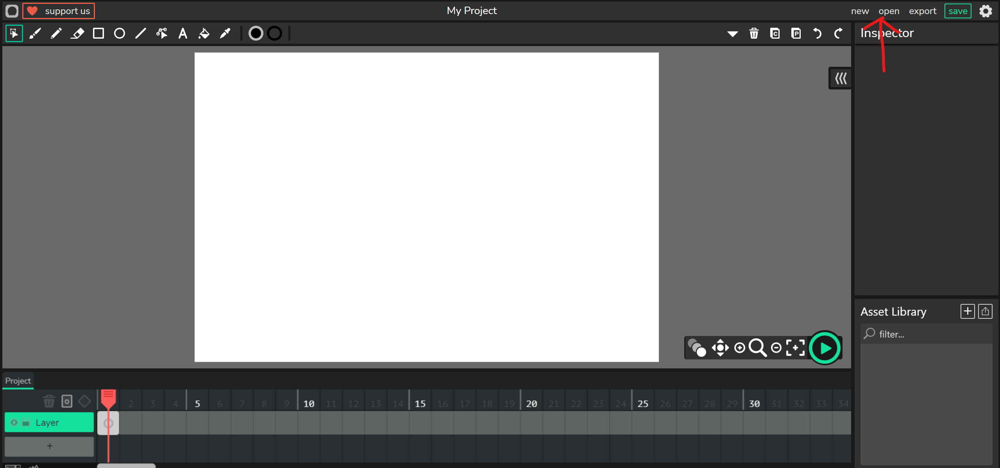
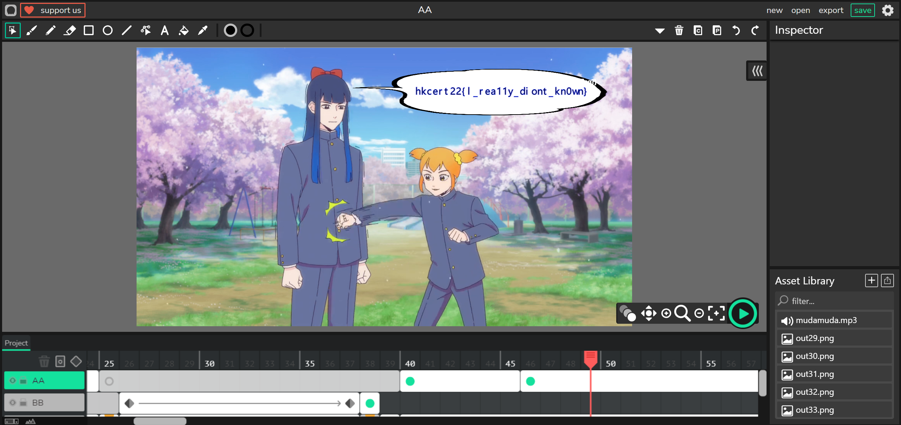

# Pop Team Eric

## - 分析

我們可以從 `popiku.html` 得出以下有用信息 <br>
- 使用 `Wick Engine` 製作以及 <a href="https://github.com/Wicklets/wick-editor">項目地址</a> <s>（原本地址不在應該是搬過去了吧）</s>
- 數據使用 `base64` 解碼




使用 vscode 打開繼續分析析析析析析析（真的很卡QAQ） <br>



可以看到長過頭的數據


## - 解密

複製一份新的 `popiku.html` 並只留下數據部分 <br>
改名爲 `wickbase64.txt`

編寫 `extract.py`
```python
import base64

src = open("wickbase64.txt", "r")
dest = open("wick.wick", "wb")

base64.decode(src, dest)
```
獲得 `wick.wick` 

到 <a href="https://www.wickeditor.com/editor/">https://www.wickeditor.com/editor/</a> 打開 `wick.wick`



**拖到後面，旗幟顯現**




## 後話

`sudo What is the flag?` wwwwwww

還有旗幟的 " `I` "(i) 並非為 " `I` "(i) <br>
而為 " `l` "(L) <br>
<s>我爲此大腦死機20分鐘</s>